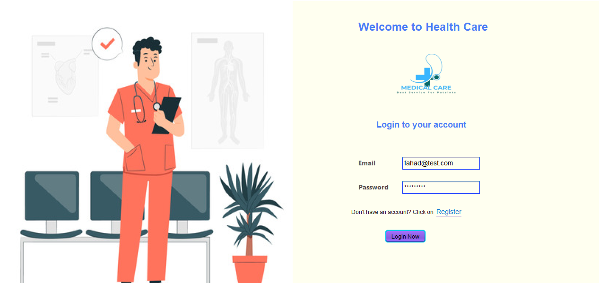
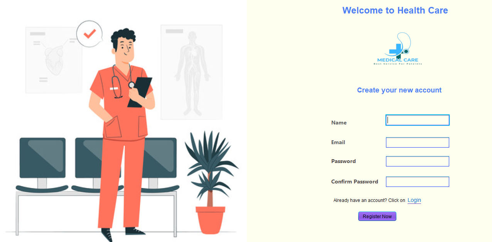
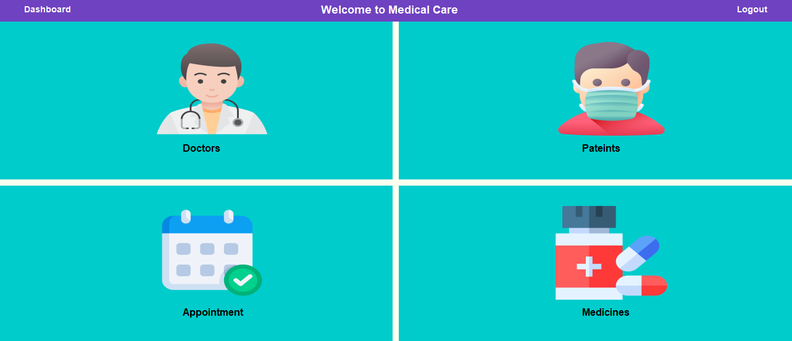
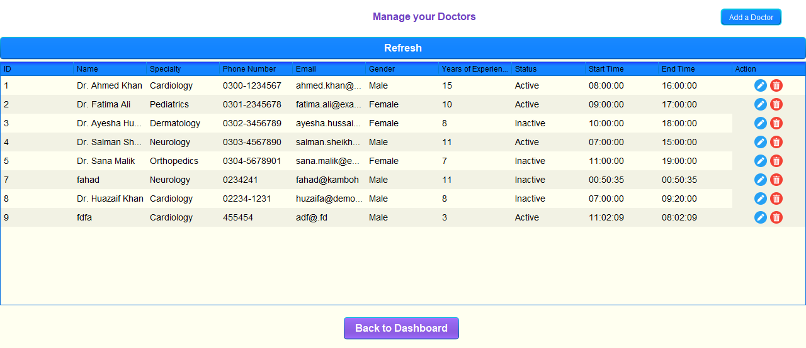
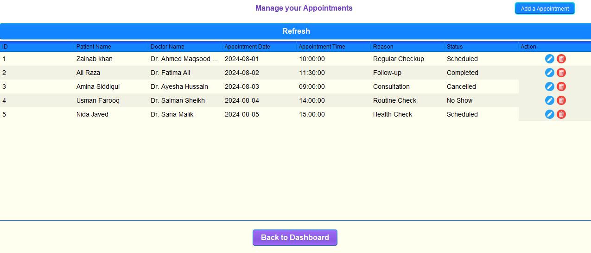
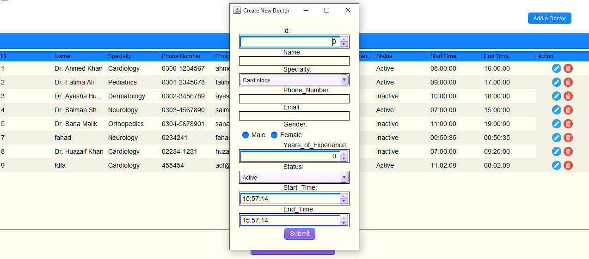
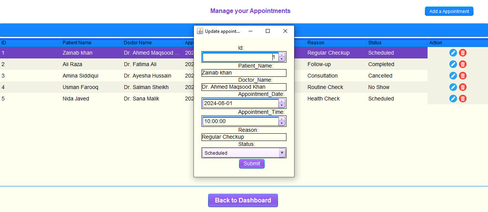

# **Hospital Management System (HMS)**  

This **Hospital Management System (HMS)** is an academic project developed for an **Object-Oriented Programming (OOP)** course. It is implemented using **Java Swing** for the user interface and **MySQL** as the database. The project adheres to clean code principles, advanced practices, and is entirely based on **OOP concepts** to leverage their power for scalability and maintainability.

---

## **Features**

### **Authentication and User Management**
- **Login functionality**: Secure authentication with validations.
- **Registration feature**: Includes field-level validation to ensure data accuracy.

### **Dashboard**
- Attractive UI design with a **central dashboard** that offers easy navigation.
- Four primary modules accessible via the dashboard:
  1. **Doctors**
  2. **Appointments**
  3. **Medicines**
  4. **Patients**

### **CRUD Operations**
- Each module supports:
  - **Create**: Add new records.
  - **Read**: View a list of records.
  - **Update**: Edit existing records.
  - **Delete**: Remove records.
  
---

## **Technologies Used**
- **Java Swing**: For building the user interface.
- **MySQL**: For database management.
- **OOP Principles**: Ensuring a modular and reusable codebase.

---

## **Project Gallery**

---

## **Setup**
To set up and run the project, refer to the [Setup Guide](Setup.md) for detailed instructions.

---

## **Acknowledgements**
This project is developed as part of an academic requirement for learning **Object-Oriented Programming** and applying its concepts in real-world applications.
